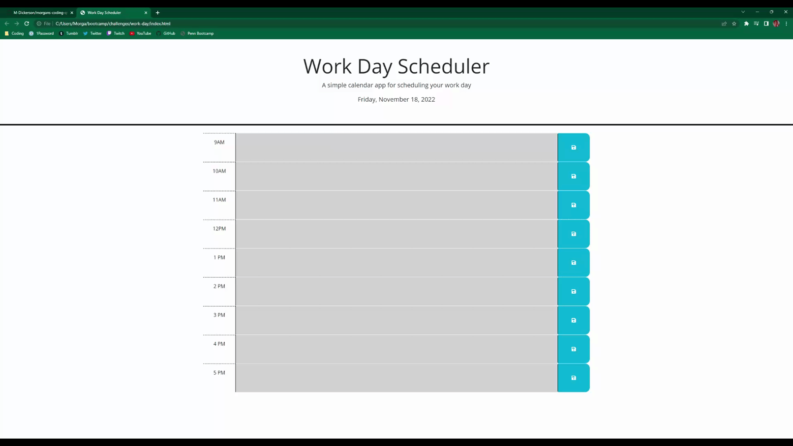

# Work Day

## Description

The motivation and purpose behind this project was to fix an already existing scheduler that wouldn't save the text entered into the text fields. It also solves the problem of the text field colors not changing as the time changes. I learned more about local storage, as well as using jQuery in place of javascript to do basic functions.

## Usage

Link to [deployed app](https://m-dickerson.github.io/work-day/)

To use the application all you have to do is input text into any field then click the save button to the right.

## License

MIT License

A short and simple permissive license with conditions only requiring preservation of copyright and license notices. Licensed works, modifications, and larger works may be distributed under different terms and without source code.